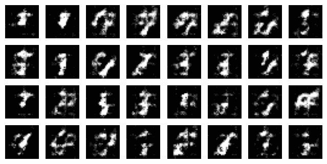

# MNIST DCGAN with Prompt

This is a handwritten number generator that allows users to utilize prompts.

## Introduction

## Installation

## Usage

## TODO

## Contributing

We welcome pull requests from contributors. If you plan to make significant changes, kindly open an issue beforehand to initiate a discussion on the proposed modifications.

Ensure that appropriate tests are updated or added along with any changes made.

Your attention to this matter is appreciated!

## License

This project is licensed under the [PROPRIETARY LICENSE](https://github.com/91d906h4/H-Go/blob/main/LICENSE), which prohibits any use, copying, modification, or distribution of the software without explicit written permission from the copyright holder.

## References

[1] @gensal, "【Pytorch】MNISTのGAN（敵対的生成ネットワーク）を実装する," Qiita, Sep. 30, 2022. [Online]. Available: https://qiita.com/gensal/items/4be65d9b36fac02f877e 
[2] lyeoni, "pytorch-mnist-GAN," GitHub. [Online]. Available: https://github.com/lyeoni/pytorch-mnist-GAN 
[3] znxlwm, "pytorch-MNIST-CelebA-GAN-DCGAN," GitHub. [Online]. Available: https://github.com/znxlwm/pytorch-MNIST-CelebA-GAN-DCGAN