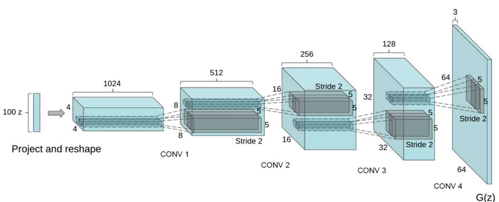
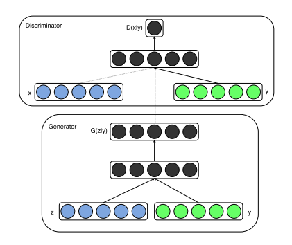
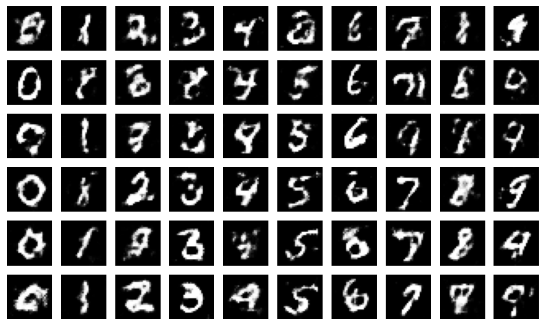

# MNIST C-DCGAN

This is a Conditional Deep Convolutional Generative Adversarial Network (C-DCGAN) for handwritten number.

## Introduction

In machine learning, generative adversarial networks (GANs) are a state-of-the-art invention. These algorithms have made significant contributions to the field of generative models by producing data that closely resembles datasets seen in the real world, for which they have received great praise. These models attempt to interpret the underlying structure of provided datasets, and are essential for jobs involving unsupervised learning.

<div align="center">
    <br />
    <i>DCGAN Generator Architecture.</i>
</div><br />

By adding more conditional information to the generation process, Conditional Generative Adversarial Networks (cGANs) are an extension of regular GANs. Class labels and other auxiliary variables are examples of additional input information that cGANs use in order to regulate the generation process, in contrast to conventional GANs that create samples from random noise vectors.

<div align="center">
    <br />
    <i>cGAN architecture.</i>
</div><br />

In order to accomplish the objective of producing handwritten numbers, we in this project combine the power of cGANs with DCGAN. Our goal is to combine these two cutting-edge methods in order to maximize the capabilities of each model and produce realistic, high-quality digit images. We are able to manage and manipulate the features of the generated digits by incorporating conditional information, such as class labels, into the generation process using the combination of cGANs and DCGAN. With potential uses in digit recognition, picture augmentation, and data synthesis, among other domains, this method creates new avenues for producing a wide range of precise and varied handwritten digits.

## Installation

Use the package manager pip or conda to install the required dependencies.

```sh
pip install -r requirements.txt
```

```sh
conda install --file requirements.txt
```

## Usage

1. Set Hyper-Parameters

Navigate to the `./src/hyperparameters.py` file and adjust the settings according to your requirements. This file contains essential configurations and parameters that influence the behavior and performance of the model. By modifying these settings, you can tailor the model's behavior to suit specific use cases and optimize its performance for desired outcomes.

2. Train the model

To begin, navigate to the `./src/main.ipynb` file and execute the notebook by selecting the "Run" option. Ensure that all required modules are correctly imported and that the parameters are appropriately configured. Upon execution, the notebook will initiate the training process for the model.

3. Generate Images

To produce handwritten numbers, utilize the `trainer.test()` function located in `./src/main.ipynb`. For additional images, employ the `trainer.test(num=num_to_gen)` method, supplying the required quantity using the `num` parameter.


If you want to run unconditional DCGAN, please jump to [dd7455e](https://github.com/91d906h4/MNIST-C-DCGAN/tree/dd7455ee1727d4148dada590e0fd710ef787c71a).

## Demonstration

The results of an GANs are shown in the first GIF. It is clear that the machine has a tendency to produce the number "1" more often. This observation could be explained by the fact that the digit "1" with its inherent simplicity and structural regularity is easier for the model to generate than other digits with more complex structures.

<div align="center">
    <br />
    <i>0 ~ 20 epoch of DCGAN.</i>
</div><br />

The results of our C-DCGAN after two training epochs are shown in the second picture. There has been a noticeable improvement, as certain recognizable numbers can now be easily identified in the created image.

<div align="center">
    <br />
    <i>C-DCGAN after 2 epochs training.</i>
</div>

## Contributing

We welcome pull requests from contributors. If you plan to make significant changes, kindly open an issue beforehand to initiate a discussion on the proposed modifications.

Ensure that appropriate tests are updated or added along with any changes made.

Your attention to this matter is appreciated!

## License

This project is licensed under the [PROPRIETARY LICENSE](https://github.com/91d906h4/MNIST-C-DCGAN/blob/main/LICENSE), which prohibits any use, copying, modification, or distribution of the software without explicit written permission from the copyright holder.

## References

[1] A. Radford, L. Metz, and S. Chintala, "Unsupervised Representation Learning with Deep Convolutional Generative Adversarial Networks," arXiv:1511.06434 [cs.LG], Nov. 2015. [Online]. Available: https://arxiv.org/abs/1511.06434<br />
[2] M. Mirza and S. Osindero, "Conditional Generative Adversarial Nets," arXiv:1411.1784 [cs.LG], Nov. 2014. [Online]. Available: https://arxiv.org/abs/1411.1784<br />
[3] @gensal, "【Pytorch】MNISTのGAN（敵対的生成ネットワーク）を実装する," Qiita, Sep. 30, 2022. [Online]. Available: https://qiita.com/gensal/items/4be65d9b36fac02f877e<br />
[4] lyeoni, "pytorch-mnist-GAN," GitHub. [Online]. Available: https://github.com/lyeoni/pytorch-mnist-GAN<br />
[5] znxlwm, "pytorch-MNIST-CelebA-GAN-DCGAN," GitHub. [Online]. Available: https://github.com/znxlwm/pytorch-MNIST-CelebA-GAN-DCGAN